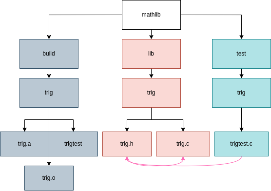

<h3 align="center">Math Library</h3>

### Map Of Content

- [Animations](animations): contains animations for documentation
- [External](external): External Libraries
- [Libraries](lib): contains all the Libraries
- [Modules](modules) : contains all the modules
- [PyLib](pylib): Extended `c` libraries ported to `python`
- [Tests](tests): test cases for all the code 

---

### What is `mathlib`? 

`mathlib` project is collection of small math scripts; I wrote them to mainly solidify my understanding on certain topics.

There will be some notes from courses and youtube series that I followed to 
grasp certain topics, you can find them in my [`garden`](https://kannna.xyz/garden/) section.

### Library

You can checkout the `library` branch if you want to just use the library;

```bash
git submodule add -b lib https://github.com/kana800/mathlib.git
```

### MakeFile

<p style="text-align: center" align="center">
  
</p>

### References

- [Numerical Recipes](http://numerical.recipes/book/book.html)
