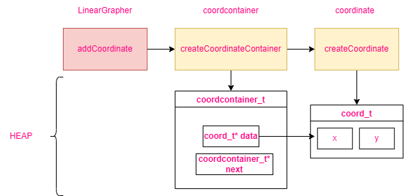

### Linear Grapher


---

### Front-End


---

### Coordinate Container

Coordinate Container is custome datastructure that holds all the 
coordinates that the user inputs to the system. 

- Why not use `VLA` (Variable Length Array) ?

> I simply don't know how many `coord_t` struct the user is going to input
the grapher and `copying` and `allocating` memory again and again when a
certain size limit is reached is too ||annoying||.

> One option is to let the user input the number of **coordinates** that they
are going to input at the start.||I don't want the user to do that||.

The **coordinate container** will imitate a **singly linked list**. 
This will allow me to control the size of the data structure the way I prefer.

- [More about VLA](https://blog.joren.ga/vla-pitfalls)
- [Notes on VLA and other DS]()

---

### Coordinates, Containers and Linear-Grapher

- Coordinate Structure:
```c
coord_t {
	x, y 
};
```

- Coordinate Container:
```c
coordcontainer_t {
	coord_t * data; // points to the data
	struct CoordContainer* next; // points to 
	//the next struct
}
```

When user adds a coordinate through the `addcoordinate` (`lineargrapher.h`);
The `CreateCoordinateContainer` in `coordcontainer.h` will create a `coord_t`
typed coordinate and allocate memory for it.



The size of the `coordcontainer_t` will be **tracked** by the 
linear grapher `GlobalContainer`. 

```c
GlobalContainer {
	coordcontainter_t* HEAD;
	int size;
} glbcontainer_t;
```

---
